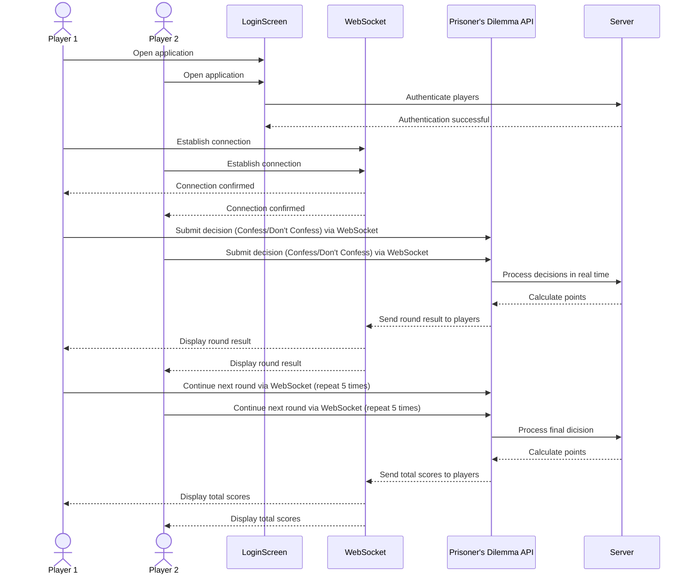

# Prisoner's Dilema

[My Notes](notes.md)

This application is a quick 5 round 2 player game. Each round both players have the choice of confessing or not confessing. Each player has 30 seconds to make their decision. Points are then awareded. If both players choose to confess they each earn 5 points. If however one player confesses while the other does not the player who did not earns 8 points while the confessor earns 0 points. If both players do not confess they each get 1 point. Both players make the exact same choice with each other 5 times. At the end of 5 rounds, the player with the most points wins!

> [!NOTE]
>  This is a template for your startup application. You must modify this `README.md` file for each phase of your development. You only need to fill in the section for each deliverable when that deliverable is submitted in Canvas. Without completing the section for a deliverable, the TA will not know what to look for when grading your submission. Feel free to add additional information to each deliverable description, but make sure you at least have the list of rubric items and a description of what you did for each item.

> [!NOTE]
>  If you are not familiar with Markdown then you should review the [documentation](https://docs.github.com/en/get-started/writing-on-github/getting-started-with-writing-and-formatting-on-github/basic-writing-and-formatting-syntax) before continuing.

## 🚀 Specification Deliverable

> [!NOTE]
>  Fill in this sections as the submission artifact for this deliverable. You can refer to this [example](https://github.com/webprogramming260/startup-example/blob/main/README.md) for inspiration.

For this deliverable I did the following. I checked the box `[x]` and added a description for things I completed.

- [x] Proper use of Markdown
- [x] A concise and compelling elevator pitch
- [x] Description of key features
- [x] Description of how you will use each technology
- [x] One or more rough sketches of your application. Images must be embedded in this file using Markdown image references.

### Elevator pitch

Have you ever heard of the Prisoner's Dilemma? Experience this classic game theory challenge in a two-player showdown! Your options are simple: confess or stay quiet. If both confess, you each earn 5 points. If one stays quiet while the other confesses, the confessor takes 8 points while the quiet one gets nothing. But if you both stay quiet, you each earn only 1 point. The catch? You must repete the dilema 5 times! Will you trust them or play it safe? It's a chance to test your strategy and psycology!  

### Design

The red boxes under the table are the buttons the user can press to submit their decision.

Here is a sequence diagram that shows how people would interact with the backend to play the game.

### Key features

- Secure login over HTTPS
- Ability to see both players scores in real time
- Buttons for each player to make a selection: confess, don't confess
- Wins and losses from previous games are persistently stored
- Timer counts down from 30 until scores are entered
- Shows the weather

### Technologies

I am going to use the required technologies in the following ways.

- **HTML** - Handles the basic structure of the application. Four HTML pages. One for login, another for the game interface, another for about info, and finally one for showing scores from preious rounds. 
- **CSS** - Styles and animates the application to provide a more visually appealing design. Handles whitespace and colorchoice so that the website looks good on different devices.
- **React** - Manages the application's dynamic behavior and state. After login switches to the game interface and refreshes both the timer and user decision.
- **Service** - Backend service with endpoints for
  - retrieving scores from previous rounds
  - submitting player choices
  - fetching game status (round number)
  - getting the weather through the getWeather api
- **DB/Login** - Store users, and previous games in database. Register and login users. Credentials securely stored in database.
- **WebSocket** - Enables real-time communication between the players and the server. Ensures smooth gameplay

## 🚀 AWS deliverable

For this deliverable I did the following. I checked the box `[x]` and added a description for things I completed.

- [ ] **Server deployed and accessible with custom domain name** - [My server link](https://yourdomainnamehere.click).

## 🚀 HTML deliverable

For this deliverable I did the following. I checked the box `[x]` and added a description for things I completed.

- [x] **HTML pages** - Four HTML pages. The first has a user login. The second has a non-functional game interface. The third displays archived scores. The fourth has information about the game, how it is scored, and what makes it interesting. 
- [x] **Proper HTML element usage** - Pages are layed out with headers, footers, and main elements. Uses a forum for the user login structure, and list elements to provide game instructions on the game interface page. Buttons are used to push the user from the login screen to the game interface and allow the player to submit a decision. A place holder for the scores page is created with a table.
- [x]  **Links** - Links in the header allow the user to navigate between all 4 pages. A link to this repository is found in the footer.
- [x] **Text** - Text formatted with the paragraph element is found in the about page, providing a description of the game and what makes it interesting.
- [x] **3rd party API placeholder** - On the about page there is a comment for where current weather information fetched from a 3rd party API will be displayed. 
- [x] **Images** - There is an image of a prison displayed in the index.html page.
- [x] **Login placeholder** - A login structure is found in the index.html page implemented with a forum.
- [x] **DB data placeholder** - The table struture found in the scores.html page serves as a placeholder for where archived scores fetched from a database will be displayed
- [x] **WebSocket placeholder** - The game.html page serves as a placeholder for the Websocket since two players face off head to head in 30 second rounds. There is a placeholder as well for where a timer counts down and where the scores of each player are displayed.

## 🚀 CSS deliverable

For this deliverable I did the following. I checked the box `[x]` and added a description for things I completed.

- [x] **Header, footer, and main content body** - Changed the headers and footers to work with bootstrap. Also reformated many of the html elements to work better with the style sheets. All pages have a consistent theme and background color.
- [x] **Navigation elements** - navigation bar looks good and displays correctly on all pages.
- [x] **Responsive to window resizing** - Application looks good with all window sizes and devices. Navigation bar collapses into a pancake stack when the window is shrunk. 
- [x] **Application elements** - Utilized good contrast and whitespace
- [x] **Application text content** - There is a consistent font and style throughout all html pages.
- [x] **Application images** - Image given a boarder and shaped in index.css.

## 🚀 React part 1: Routing deliverable

For this deliverable I used JavaScript and React so that the application can now dynamically rout the user between pages without the use of hyperlinks. There are still placeholders for future technologies.

- [x] **Bundled using Vite** - Done!
- [x] **Components** - Login, play, Scores, and About are all components with mocks for login, WebSocket, live score updates, and fetching the weather.
- [x] **Router** - Routing between login and voting components.

## 🚀 React part 2: Reactivity

For this deliverable I did the following. I checked the box `[x]` and added a description for things I completed.

- [ ] **All functionality implemented or mocked out** - I did not complete this part of the deliverable.
- [ ] **Hooks** - I did not complete this part of the deliverable.

## 🚀 Service deliverable

For this deliverable I did the following. I checked the box `[x]` and added a description for things I completed.

- [ ] **Node.js/Express HTTP service** - I did not complete this part of the deliverable.
- [ ] **Static middleware for frontend** - I did not complete this part of the deliverable.
- [ ] **Calls to third party endpoints** - I did not complete this part of the deliverable.
- [ ] **Backend service endpoints** - I did not complete this part of the deliverable.
- [ ] **Frontend calls service endpoints** - I did not complete this part of the deliverable.

## 🚀 DB/Login deliverable

For this deliverable I did the following. I checked the box `[x]` and added a description for things I completed.

- [ ] **User registration** - I did not complete this part of the deliverable.
- [ ] **User login and logout** - I did not complete this part of the deliverable.
- [ ] **Stores data in MongoDB** - I did not complete this part of the deliverable.
- [ ] **Stores credentials in MongoDB** - I did not complete this part of the deliverable.
- [ ] **Restricts functionality based on authentication** - I did not complete this part of the deliverable.

## 🚀 WebSocket deliverable

For this deliverable I did the following. I checked the box `[x]` and added a description for things I completed.

- [ ] **Backend listens for WebSocket connection** - I did not complete this part of the deliverable.
- [ ] **Frontend makes WebSocket connection** - I did not complete this part of the deliverable.
- [ ] **Data sent over WebSocket connection** - I did not complete this part of the deliverable.
- [ ] **WebSocket data displayed** - I did not complete this part of the deliverable.
- [ ] **Application is fully functional** - I did not complete this part of the deliverable.
